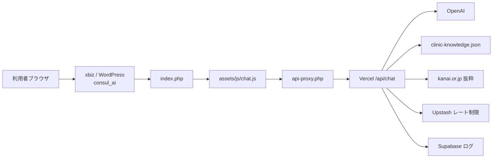

# chat-kanai 仕様書（簡易版）

金井産婦人科向け **AIお悩み相談** チャットの構成・役割・データの流れをまとめたドキュメントです。

| 項目 | 内容 |
|------|------|
| 目的 | 診断ではなく、不安の受け止め・受診前の一般案内・当院手続きの案内 |
| 画面 URL（想定） | `https://kanailc.xbiz.jp/consul_ai/` |
| API（想定） | `https://st-spica-chat-kanai.vercel.app/api/chat` |

---

## 1. サイトマップ（ファイル構成）

```
chat-kanai/
├── index.php                 # チャット画面（WPヘッダー／フッター）
├── api-proxy.php             # ブラウザ → Vercel への中継（秘密鍵はここだけ）
├── api-proxy-config.php      # プロキシ設定（upstream / secret）※公開禁止
├── api-proxy-config.example.php
├── .htaccess                 # 設定ファイル直アクセス禁止など
├── assets/
│   ├── css/style.css         # チャットUI用CSS
│   └── js/chat.js            # フロント表示・送受信
├── api/                      # Vercel 上で動く API（xbiz には載せない）
│   ├── chat.js               # メインAPI（プロンプト・緊急判定・OpenAI）
│   ├── _clinicKnowledge.js   # 院内FAQ（JSON）の検索・抜粋
│   ├── _siteKnowledge.js     # 公式サイトHTMLの取得・キャッシュ
│   ├── _ratelimit.js         # レート制限（Upstash）
│   ├── _chatLog.js           # 会話ログ（Supabase）
│   └── daily-report.js       # 日次レポートメール
├── data/
│   ├── clinic-knowledge.json # 院内FAQ（現行の知識データ）
│   └── x_clinic-knowledge.csv# 旧CSV（参考・現行未使用）
├── supabase/
│   └── chat_logs.sql         # ログテーブル定義
├── package.json              # Vercel用 Node 依存
└── vercel.json               # 関数タイムアウト・Cron
```

### どこに何を置くか

| 置き場所 | 載せるもの | 載せないもの |
|----------|------------|--------------|
| **xbiz（WordPress）** `consul_ai/` | `index.php`, `api-proxy*.php`, `assets/`, `.htaccess` | `api/`, `data/`, `node_modules/` |
| **Vercel** | `api/`, `data/`, `package.json` | `*.php`, `.htaccess` |

---

## 2. 全体構成図



---

## 3. リクエストの流れ（簡単）

1. 利用者が `index.php` の画面で質問を送信する  
2. `assets/js/chat.js` が `./api-proxy.php` に POST（ストリーム）  
3. `api-proxy.php` がサーバー側だけ持つ secret を付けて Vercel へ転送  
4. `api/chat.js` が処理：
   - 認証・レート制限
   - **緊急ワード** → OpenAI を呼ばず定型の救急誘導
   - それ以外 → FAQ／必要時サイト抜粋＋**システムプロンプト**で OpenAI 呼び出し
   - 回答をストリーム返却、ログ保存
5. フロントが吹き出しに表示（リッチHTMLは DOMPurify でサニタイズ）

---

## 4. コード内容の要約

### 4.1 フロント（xbiz）

| ファイル | 役割（簡単） |
|----------|--------------|
| `index.php` | WP のヘッダー／フッター付き HTML。CSS・JS を読み込むだけ |
| `assets/js/chat.js` | 送信、履歴、ストリーム表示、RICH_HTML 整形、参照リンク表示 |
| `assets/css/style.css` | 吹き出し・入力欄などの見た目 |
| `api-proxy.php` | API の入り口。秘密情報をフロントに出さないための中継 |

> **注意:** プロンプトや緊急ワードはフロントにはありません。

### 4.2 API（Vercel）— ここが「頭脳」

| ファイル | 役割（簡単） |
|----------|--------------|
| `api/chat.js` | **システムプロンプト**、**緊急ワード判定**、OpenAI 呼び出し、ストリーム応答 |
| `api/_clinicKnowledge.js` | `data/clinic-knowledge.json` から関連 FAQ を抜粋 |
| `api/_siteKnowledge.js` | 公式サイトページを取得・キャッシュし、必要時に補完 |
| `api/_ratelimit.js` | IP あたりのアクセス制限（例: 60秒に20回） |
| `api/_chatLog.js` | 会話を Supabase に保存 |
| `api/daily-report.js` | 前日分ログをメール送信（Cron） |

### 4.3 プロンプト・緊急ワードの場所

| 種類 | 場所 |
|------|------|
| システムプロンプト（指示文） | `api/chat.js` の `SYSTEM` |
| 緊急ワード一覧 | `api/chat.js` の `detectEmergency()` |
| 緊急時の定型文 | `api/chat.js` の `emergencyMessage()` |

緊急ワードの例: 大量出血、強い腹痛、意識、けいれん、破水、胎動減少 など。

---

## 5. 主な機能

| 機能 | 概要 |
|------|------|
| ストリーミング応答 | 回答を少しずつ返して表示 |
| リッチHTML | 診療時間・料金などは表形式HTML（`[[[RICH_HTML]]]`） |
| 緊急検知 | 危険サインのワードで救急誘導（AIを呼ばない） |
| 院内FAQ | JSON から関連Q&Aを根拠に回答 |
| Web補完 | FAQが弱いとき公式サイト抜粋を追加（設定でON/OFF可） |
| 参照チップ | 回答下に公式ページへのリンクを表示 |
| レート制限 | 連打・悪用を抑止 |
| 会話ログ／日次レポート | Supabase保存＋メール集計 |
| WP一体表示 | 金井LCサイトのヘッダー／フッターを流用 |

---

## 6. データ

| データ | 用途 |
|--------|------|
| `data/clinic-knowledge.json` | 院内FAQ（質問・回答・参照URL）。回答の主根拠 |
| Supabase `chat_logs` | 会話ログ（日次レポート用） |
| Upstash Redis | レート制限・サイト知識キャッシュ |

---

## 7. 設定（概要）

### xbiz

- `api-proxy-config.php` … `upstream`（Vercel API URL）と `secret`
- `secret` は Vercel の `CHAT_API_SECRET` と同じ値にする
- 実値は仕様書・Git 公開先に書かない

### Vercel（主な環境変数）

| 変数 | 用途 |
|------|------|
| `OPENAI_API_KEY` | OpenAI |
| `OPENAI_MODEL` | モデル名（未設定時 `gpt-4o-mini`） |
| `CHAT_API_SECRET` | プロキシ認証 |
| `UPSTASH_REDIS_*` | レート制限・キャッシュ |
| `SUPABASE_*` | ログ |
| `RESEND_*` / `REPORT_*` | 日次メール |
| `CLINIC_WEB_SUPPLEMENT` | Web補完のON/OFF |

---

## 8. 編集・デプロイの目安

| 変えたいこと | 触るファイル | 反映先 |
|--------------|--------------|--------|
| 画面の見た目・文言（注意書きなど） | `index.php`, `assets/*` | xbiz にアップロード |
| プロンプト・緊急ワード・AI挙動 | `api/chat.js` | Vercel デプロイ |
| 院内FAQの内容 | `data/clinic-knowledge.json` | Vercel デプロイ |
| APIのURL・秘密鍵 | `api-proxy-config.php` | xbiz のみ（公開禁止） |

---

## 9. 関連ドキュメント外メモ

- フロントの JS は表示用。**指示文はサーバー（`api/chat.js`）専用**。
- `api/` や `data/` を xbiz に上げるとプロンプトやFAQがURLで読まれる恐れがあるため、**上げない**。
- `.htaccess` に古い Basic認証パスを入れると **500** になることがある（現行は設定ファイル保護のみ）。

---

*作成日: 2026-07-31 / リポジトリ: chat-kanai*
